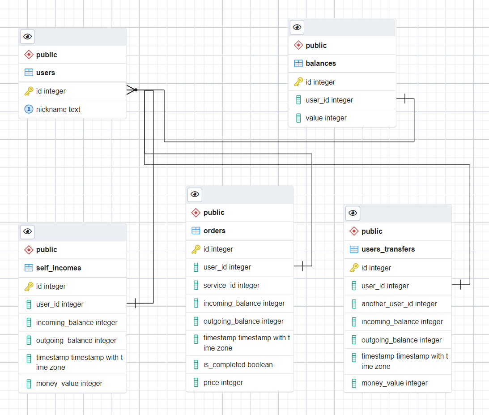

# microservice-for-working-with-user-balance

## Задача

Необходимо реализовать микросервис для работы с балансом пользователей (зачисление средств, списание средств, перевод средств от пользователя к пользователю, а также метод получения баланса пользователя). Сервис должен предоставлять HTTP API и принимать/отдавать запросы/ответы в формате JSON.

## Инструкция по запуску

1. Клонировать репозиторий локально в любую деректорию своего устройства \
``` git clone https://github.com/Owner-maker/microservice-for-working-with-user-balance.git```
2. Перейти в директорию проекта вручную или с помощью консоли \
```cd microservice-for-working-with-user-balance```
3. Создать и запустить Docker - контейнер ```docker-compose build && docker-compose up```
4. После запуска контейнера все сущности автоматически будут созданы в базе данных
5. Также будут автоматически добавлены 2 тестовых пользователя с отсутствующими балансами \
```Их id = 1 и id = 2 соответственно```
6. После запуска контейнера будет также доступна html - страница Swagger для удобства тестирования API \
```http://localhost:8080/swagger/index.html#/```

### Какие технологии использовались:
- Golang
- Gin
- Gorm
- PostgreSQL
- Swagger
- Docker

### <a name="up"></a>Какие методы реализованы:

- [Получение баланса пользователя](#getBalance)
- [Пополнение баланса пользователя](#topUpBalance)
- [Покупка услуги пользователем (резервирование средств)](#buyService)
- [Признание выручки - подтверждение выполнения услуги](#approveService)
- [Разрезервирование средств - отмена услуги](#canselService)
- [Перевод средств другому пользователю](#transfToUser)
- [Создание csv файла (отчёта) с данными о суммарной выручке за все услуги за определенный месяц и год](#createScv)
- [Получение данных с отчёта о суммарной выручке всех услуг](#getServicesInfo)
- [Получение транзакций пользователя с пагинацией и сортировкой по атрибутам транзакции](#getUsersTransacts)

### Структура базы данных



## Примеры запросов:

Для удобства использования API был использован Swagger, но примеры ниже будут представлены в текстовом виде

### <a name="getBalance">Получить баланс пользователя</a> - метод POST
```http://localhost:8080/user/balance``` \
Принимает id пользователя

```
{
    "id" : 1,
}
```

В ответ получаем баланс пользователя
```
{
    "balance": 510
}
```

### <a name="topUpBalance">Пополнить баланс пользователя</a> - метод PATCH
[все методы](#up) \
```http://localhost:8080/user/balance/topup```
- Принимает id пользователя и сумму для зачисления
- В случае отсутствия кошелька - будет создан автоматически
```
{
    "id" : 2,
    "value" : 400
}
```
В ответ получаем итоговый баланс пользователя
```
{
    "balance": 800
}
```

### <a name="buyService">Покупка услуги - резервирование средств</a> - метод POST
```http://localhost:8080/user/buy/service``` 

Принимает id пользователя и услуги, стоимость услуги
```
{
    "user_id" : 1,
    "service_id" : 1,
    "price" : 40
}
```
Получаем остаток на счете пользователя и id оформленного заказа
```
{
    "balance": 510,
    "order_id": 1
}
```

### <a name="approveService">Подтверждение покупки услуги</a> - метод PATCH
[все методы](#up) \
```http://localhost:8080/user/perform/service``` 

Принимает id пользователя, услуги и оформленного ранее заказа
```
{
    "user_id" : 1,
    "service_id" : 1,
    "price" : 22
}
```
Получаем статус ОК - 200

### <a name="canselService">Отмена услуги - разрезервирование средств</a> - метод DELETE
```http://localhost:8080/user/cancel/service``` 

Принимает id пользователя, услуги и оформленного ранее заказа
```
{
    "user_id" : 1,
    "service_id" : 2,
    "order_id": 22
}
```
Получаем статус ОК - 200

### <a name="transfToUser">Перевод средств другому пользователю</a> - метод PATCH
[все методы](#up) \
```http://localhost:8080/users/transfer``` 

Принимает id пользователей: отправителя и получателя, количество единиц денег
```
{
    "user_sender_id" : 1,
    "user_getter_id" : 2,
    "value" : 50
}
```
Получаем остаток на счете пользователя - отправителя
```
{
    "balance": 550
}
```

### <a name="createScv">Создать отчёт по оказанным услугам</a> - метод POST
```http://localhost:8080/services/report``` 

Принимает год и месяц для формирования отчёта
```
{
    "year":2022,
    "month":11
}
```
Получаем url для доступа к данным отчёта
```
{
    "report": "http://localhost:8080/static/services"
}
```

### <a name="getServicesInfo">Получить данные с отчета по оказанным услугам</a> - метод GET
[все методы](#up) \
```http://localhost:8080/static/services``` 

Получаем данные с отчета
```
{
    "report": [
        {
            "ServiceID": 1,
            "Sum": 170
        },
        {
            "ServiceID": 2,
            "Sum": 200
        }
    ]
}
```

### <a name="getUsersTransacts">Получить транзакции пользователя</a> - метод POST
```http://localhost:8080/user/transactions```

Принимает:
- id пользователя
- limit - количество транзакций за запрос
- page - отступ (смещение) на заданное значение -> limit
- sort - значение сортировки
  - в формате "<поле транзакции> <значение сортировки>"
  - 1 значение - поле транзакции
  - 2 значение - desc или asc, по убыванию или возрастанию
  - атрибут для сортировки может быть также money_value (количество единиц денег в проведенной транзакции)
  - но и также атрибут может быть любым (к примеру, incoming_balance)
```
{
    "user_id": 1,
    "limit": 4,
    "page": 1,
    "sort": "timestamp desc"
}
```
Получаем транзакции в данном случае отсортированные по времени по убыванию
```
{
    "transactions": [
        {
            "incoming_balance": 550,
            "outgoing_balance": 510,
            "timestamp": "2022-11-18T21:00:01.992568+04:00",
            "money_value": 40,
            "description": "payment of service  #1"
        },
        {
            "incoming_balance": 550,
            "outgoing_balance": 500,
            "timestamp": "2022-11-18T20:54:15.693903+04:00",
            "money_value": 50,
            "description": "replenishment of balance to user Silvester Stallone"
        },
        {
            "incoming_balance": 0,
            "outgoing_balance": 600,
            "timestamp": "2022-11-18T20:52:59.230209+04:00",
            "money_value": 600,
            "description": "replenishment of the balance"
        }
    ]
}
```

### Ошибки

В случае несуществующего id пользователя, заказа, введения отрицательного значения валюты для перевода или пополнения будет возвращен ответ 400 с ошибкой 

Например

```
{
    "error": "there is no such user"
}
```

### Что хотелось бы реализовать:
1. unit - тесты, процесс разработки был бы гораздо быстрее
2. Добавление кэширования (сессий) для увеличения быстродействия взаимодействия с базой данных
3. Добавление транзакций в методы и распараллеливания (добавления новых goroutine) для увеличения эффективности приложения
4. Добавление способа "выдачи" csv - отчета, а не конвертирования его данных в JSON - формат
5. Рефакторинг кода и более обширное применение best practices,  было крайне интересно поработать на этом языке с нуля, реализуя данный проект
6. Если добавить распараллеливание, то скорее всего появится необходимость в распределенной очереди для выполнения асинхронных запросов
7. Изучить нюанс, связанный с GET запросом в Swagger: вместо GET запросов с телом запроса (JSON) были использованы POST запросы из-за того, что в Swagger UI пока не добавили возможность при GET запросе отправлять в теле запроса данные JSON формата, но, возможно, это зависит от версии используемой технологии
8. Думаю было бы правильней сделать баланс с значением с плавающей точкой


## Вопросы / примечания по ТЗ
1. Резервирование средств: должно ли присутствовать отдельное поле как "резервный" счет пользователя?
  - Я реализовал это следующим образом - как таковое резервирование средств, насколько я понимаю, это списание денежных средств с "основного" счета пользователя (поле "balance" сущности "user") и начисление их на "резервный" (отдельный) счет пользователя, поэтому при покупке услуги, с поля "value" сущности "balance" списываются средства в размере стоимости услуги и создается новая "транзакция" (а именно сущность "Order"), которая уже хранит в себе информацию о т.н. зарезервированных средствах. Такая транзакция обладает статусом "is_completed" (по умолчанию false), а после того, как услуга будет выполнена "транзакция" получает статус true и заполняется поле "timestamp" (время выполнения услуги), если услуга была отменена/не выполнена, "зарезервированные" средства возвращаются на "основной" счет пользователя (поле "balance"), а поля "incoming_balance", "outgoing_balance", "timestamp" заполняются повторно.
2. Поля "id услуги" и "id заказа" в теле запроса на резервирование средств, необходимо ли оно?
  - На мой взгляд тут два сценария: либо данный микросервис ничего не знает о том, за какие именно услуги у пользователя списываются средства с баланса и тогда ему необходимо принимать поле "id услуги" и ее стоимость, а сервис является лишь неким акселератором данных о средствах пользователя, либо же сервис (также здесь подразумеваю и наличие соотвествующих сущностей в БД) уже обладает некой информацией заранее о том, за что именно у пользователя будут списываться средства (есть список услуг). При втором подходе сервис должен контролировать наличие услуг и отвечать за их валидацию, на мой взгляд, это уже не отвечает требованиям того, чем должен заниматься сервис, его задача - принять и обработать информацию о том, какая денежная транзакция произошла и за что списать / начислить деньги, соотвественно я выбрал первый вариант, при котором сущность "order" помимо всего прочего будет хранить в себе поле "id услуги", но не в роли внешнего ключа, а как информацию от другого сервиса, к примеру о том, что была оказана именно такая услуга под таким идентификатором, что в конечном итоге может уже использовать другой сервис, который, к примеру, отвечает исключительно за услуги и т.п.
  - В поле "id заказа" на мой взгляд при резервировании средств нет смысла, так как данная сущность будет только создана при вызове соотсветствующего метода (API), но оно уже будет необходимо при признании выручки или разрезервировании средств.
  - В случае признания выручки на мой взгляд поле "price" будет излишним, т.к. информация об уже зарезервированных средствах есть в БД.
